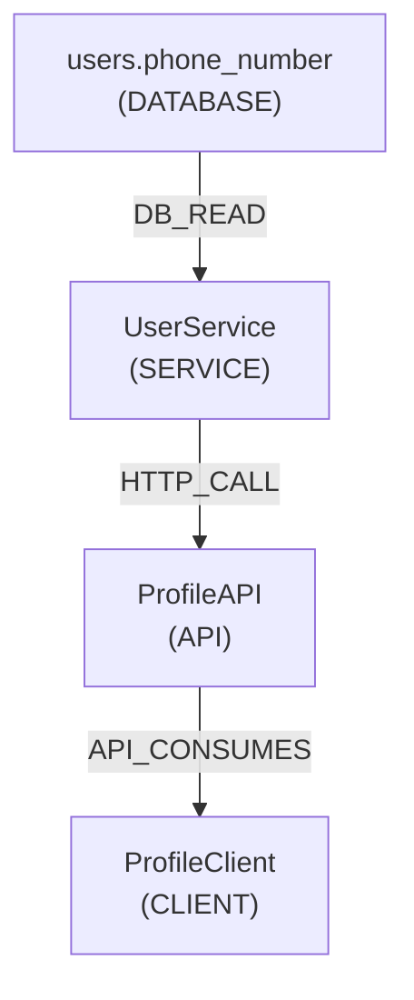

# Demo Commerce — Analysis Fixture

This directory contains the canonical **Day 1 analysis fixture** for PreFlight.

It models a simplified but realistic multi-service commerce system used to
demonstrate and test PreFlight's dependency graph, traversal, and
deterministic serialization foundation.

---

## System Overview

**Demo Commerce** is a fictional production system with four components:

| Component | Type | Language | Role |
|---|---|---|---|
| `users` database | Database | SQL | Persistent user storage |
| `UserService` | Backend service | Python | Reads user data, forwards to profile layer |
| `ProfileAPI` | REST API | Python | Exposes user profiles to external consumers |
| `AndroidClient` (`ProfileClient`) | Mobile client | Kotlin | Displays user profiles in an Android UI |

---

## The Dependency Chain

The canonical Day 1 dependency scenario traces what happens when the
`phone_number` column in the `users` table changes.



### Why `phone_number` matters

`phone_number` is the dependency-bearing entity for this scenario because:

1. It is **nullable** — a change from `TEXT` to `NOT NULL` is a breaking migration.
2. It flows through **every layer** — DB → service → API → mobile client.
3. The Android client **displays it in the UI** — a rename or type change
   would break the mobile app silently without PreFlight.
4. It creates a realistic **3-hop blast radius** to demonstrate traversal.

---

## Expected Day 1 Graph

| Field | Value |
|---|---|
| Nodes | 4 |
| Edges | 3 |
| Canonical hop count | 3 |

### Nodes (sorted by entity_id)

```
android-client.ProfileClient
profile-api.ProfileAPI
user-service.UserService
users.phone_number
```

### Edges

```
users.phone_number  --DB_READ-->      user-service.UserService
user-service.UserService --HTTP_CALL--> profile-api.ProfileAPI
profile-api.ProfileAPI   --API_CONSUMES--> android-client.ProfileClient
```

### Canonical Path

```
nodes: [
  "users.phone_number",
  "user-service.UserService",
  "profile-api.ProfileAPI",
  "android-client.ProfileClient"
]
edges: ["DB_READ", "HTTP_CALL", "API_CONSUMES"]
hop_count: 3
```

---

## Component Details

### `database/schema.sql`

Defines the `users` table. The `phone_number` column on line 6 is the
tracked entity.

### `user-service/src/user_service.py`

`UserService` reads `phone_number` from the `users` table via SQL SELECT.
It then forwards the enriched payload to ProfileAPI via HTTP POST.

### `profile-api/src/profile_api.py`

`ProfileAPI` exposes `GET /profile/{user_id}` and returns a
`ProfileResponse` that includes `phone_number` sourced from UserService.

### `android-client/src/profile_client.kt`

`ProfileClient` calls `GET /profile/{userId}` and displays
`phoneNumber` in the Android UI.

---

## Status

This fixture is a **static analysis target**, not executable production code.
Tree-sitter-based automatic dependency extraction begins on **Day 2**.
